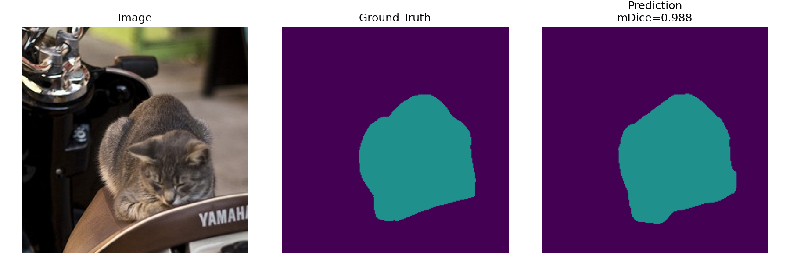
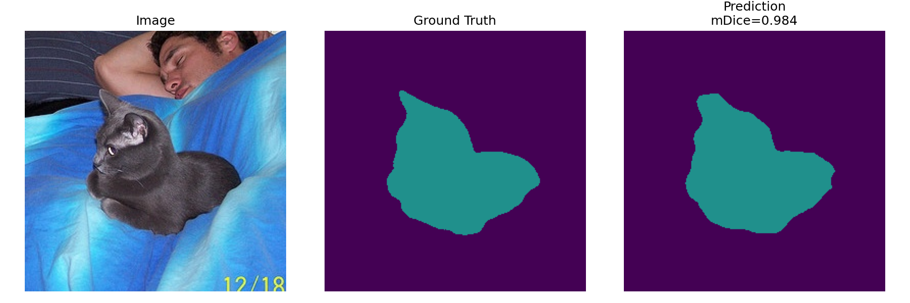
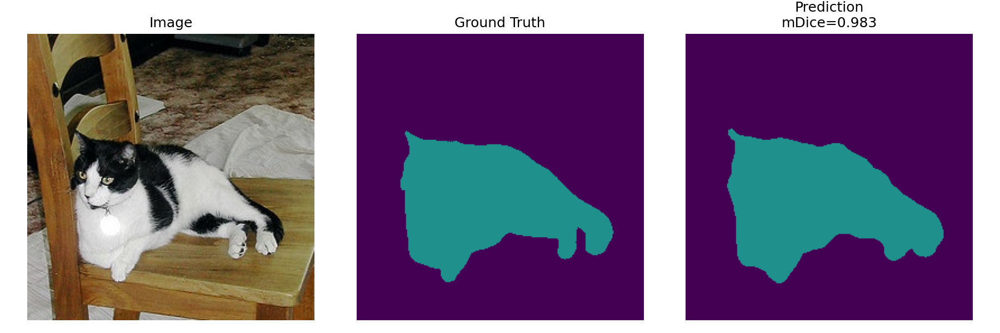
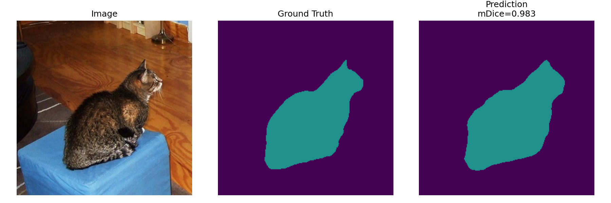
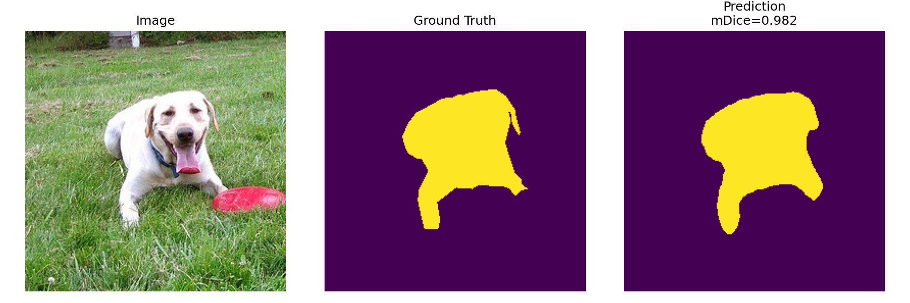
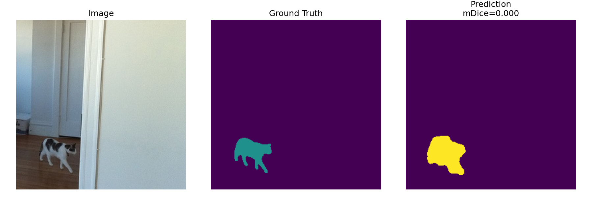
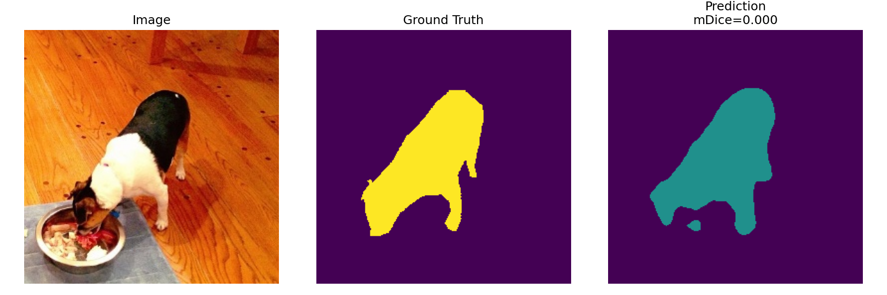
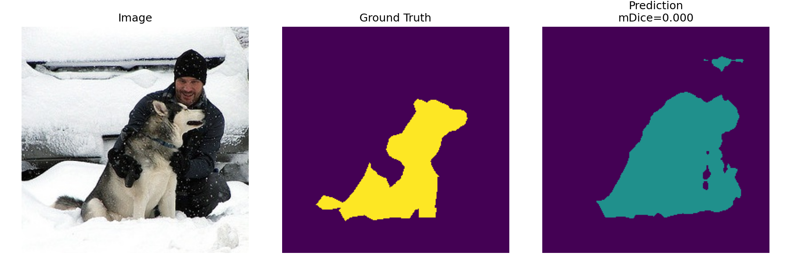
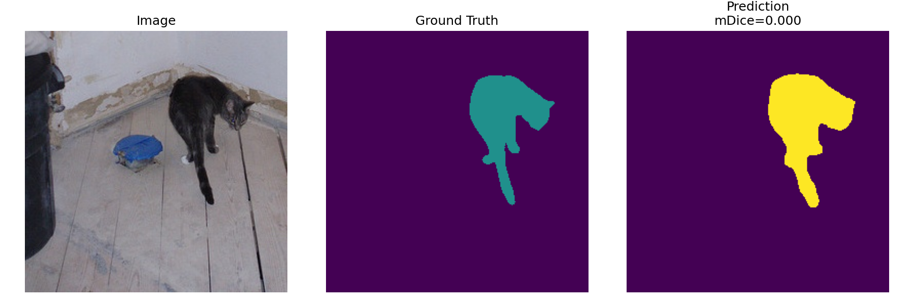
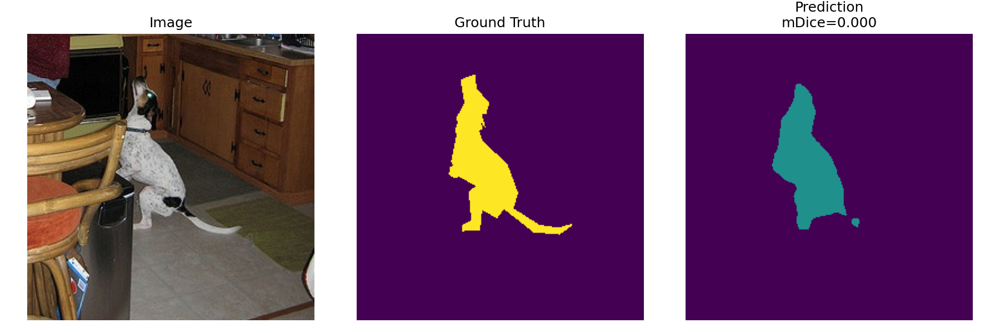

# Выбор и обучение модели из mmsegmentation для задачи мультиклассовой семантической сегментации (Semantic Segmentation Project)

В рамках проекта был реализован полный пайплайн обучения модели семантической сегментации с использованием фреймворка MMSegmentation. 

Основная цель проекта: достичь значения метрики mDice > 0.75 на тестовом датасете.

В процессе работы были выполнены:
- анализ и очистка датасета (EDA)
- построение baseline модели
- серия экспериментов по улучшению качества
- выбор лучшего решения и анализ результатов
- был получен итоговый результат: mDice (test) = 0.9018
  
# Этап 1. Исследовательский анализ (EDA)

Датасет содержит изображения и маски сегментации с тремя классами:
- класс 0 — фон (~90%)
- класс 1 — объект 1 (~5.6%)
- класс 2 — объект 2 (~4.2%)

**Проведён анализ качества данных**
- распределения классов
- площади объектов
- размеров изображений (все изображения 256x256)
- соотношения классов на изображениях

**Найденные проблемы**
- Сильный дисбаланс классов (фон доминирует)
- Наличие шумовых/пустых масок (доля < 0.5%)
- Отсутствие изображений с одновременным присутствием классов 1 и 2
  
**Очистка данных**
Были удалены изображения с пустыми масками (порог < 0.005 доли пикселей объекта). Далее в проекте использовался очищенный датасет.

**Основные выводы EDA**
- Датасет сильно несбалансирован
- Модель будет склонна предсказывать фон
- Необходимо компенсировать дисбаланс (loss / weights)

[Ноутбук EDA](segmentation_eda.ipynb)

# Этап 2. Формирование первичных гипотез

**Стартовая гипотеза 1 — простой baseline**
- Лёгкая модель и стандартный loss, чтобы получить стартовую точку. В качестве baseline была выбрана модель SegFormer-B0. Это лёгкая архитектура семантической сегментации, подходящая для быстрого запуска первого эксперимента на небольшом датасете.
- Модель: SegFormer-B0
- Loss: CrossEntropy
- Оптимизатор: AdamW
- Без дополнительных улучшений

**Результаты обучения**
- Конфиг:   [segformer_b0_baseline.py](configs/practicum/segformer_b0_baseline.py)
- ClearML:  [segformer_b0_baseline](https://app.clear.ml/projects/412d1b341d5d427eabcbd011a4dafccf/tasks/110bec895f414ed0bfea44c855b449ac/)
- mDice ≈ 0.5215

Анализ и Вывод: модель обучается стабильно, слабая сегментация объектов из-за дисбаланса классов


**Стартовая гипотеза 2 — baseline с учётом дисбаланса**
- EDA показал сильный дисбаланс классов: фон занимает около 90% пикселе. Добавляем DiceLoss к CrossEntropyLoss, это может улучшить качество сегментации целевых объектов.
- Модель: SegFormer-B0
- Loss: CrossEntropy + DiceLoss
  
**Результаты обучения**
- Конфиг:   [segformer_b0_ce_dice.py](configs/practicum/segformer_b0_ce_dice.py)
- ClearML:  [segformer_b0_ce_dice](https://app.clear.ml/projects/412d1b341d5d427eabcbd011a4dafccf/tasks/74dd1d05477e4b1b80c7c93a51e7df8f/)
- mDice ≈ 0.5229

Анализ и Вывод: Добавление DiceLoss к CrossEntropyLoss не дало значимого улучшения, поэтому дальнейшие эксперименты будут направлены на увеличение разнообразия данных, усложнение архитектуры и компенсацию дисбаланса классов.


# Этап 3. Эксперименты по улучшению качества

**Эксперимент 1: Аугментации**
Добавлены:повороты, фотометрические искажения

**Результаты**
- Конфиг:   [segformer_b0_aug.py](configs/practicum/segformer_b0_aug.py)
- ClearML:  [segformer_b0_aug](https://app.clear.ml/projects/412d1b341d5d427eabcbd011a4dafccf/tasks/25481ca3e5954ff4a42f8ca08283ec52/)
- mDice ≈ 0.5401

Анализ и Вывод: качество ухудшилось, аугментации слишком агрессивны для данного домена


**Эксперимент 2 — Class Weights**
Добавлены веса классов для компенсации дисбаланса (class_weight = [0.3, 1.5, 1.7])

**Результаты**
- Конфиг:   [segformer_b0_class_weights.py](configs/practicum/segformer_b0_class_weights.py)
- ClearML:  [segformer_b0_class_weights](https://app.clear.ml/projects/412d1b341d5d427eabcbd011a4dafccf/tasks/b1ecfb3bdfff451e9c843bd728e026fd/)
- mDice ≈ 0.580

Анализ и Вывод: модель стала лучше учитывать редкие классы, есть рост качества по объектам


**Эксперимент 3 — Усложнение модели (SegFormer-B2)**
Увеличена сложность модели (B2)

**Результаты**
- Конфиг:   [segformer_b2_baseline.py](configs/practicum/segformer_b2_baseline.py)
- ClearML:  [segformer_b2_baseline](https://app.clear.ml/projects/412d1b341d5d427eabcbd011a4dafccf/tasks/bd72677f19b542f4a4714f3745f4cd21/)
- mDice ≈ 0.5742

Анализ и Вывод: модель лучше извлекает признаки, заметный прирост качества


**Эксперимент 4 — SegFormer-B2 + Class Weights (лучший)**
Комбинация более мощной архитектуры и компенсации дисбаланса классов

**Результаты**
- Конфиг:   [segformer_b2_class_weights.py](configs/practicum/segformer_b2_class_weights.py)
- ClearML:  [segformer_b2_class_weights](https://app.clear.ml/projects/412d1b341d5d427eabcbd011a4dafccf/tasks/00ceb5d99a414851b6076a08110ff253/)
- mDice ≈ 0.9018

Анализ и Вывод: значительное улучшение качества, модель хорошо сегментирует объекты, возможны признаки переобучения (снижение после пика)

# Этап 4. Заключение и выбор лучшего эксперимента
Лучший эксперимент SegFormer-B2 + class weights с результатом: mDice (test subset) = 0.9018
- учитывает дисбаланс классов
- использует более мощную архитектуру
- показывает стабильный рост метрики

# Примеры корректных предсказаний






# Примеры ошибок







**Возможности для улучшения**
- более точная настройка class weights
- использование focal loss
- увеличение датасета
- более аккуратные аугментации
- ранний stopping для борьбы с переобучением

# Этап 5. Документация кода
practicum_work
- ├── src
- │   ├── data — обработка и анализ данных
- │   │   ├── eda.py - анализ датасета
- │   ├── analysis — анализ качества моделей
- │   │   │   ├── compute_per_image_dice.py - подсчёт Dice score по каждому изображению
  │   │   │   ├── dump_model_predictions.py - шаблон для сохранения предсказаний модели
  │   │   │   └── save_best_and_worst_predictions.py - сохранение лучших и худших примеров по Dice score
- │   │   ├── metrics.py - расчёт метрик
- │   │   ├── visualize.py - визуализация предсказаний
- │   └── supplementary/
│             └── viz/
│               ├── eda/
│               ├── cleaning/
│               ├── experiments/
│               └── best_model/


В проекте был реализован полный цикл ML-разработки:
- анализ данных
- построение baseline
- проведение экспериментов
- улучшение модели
- достижение целевой метрики
  
Финальный результат: mDice = 0.9018


```


